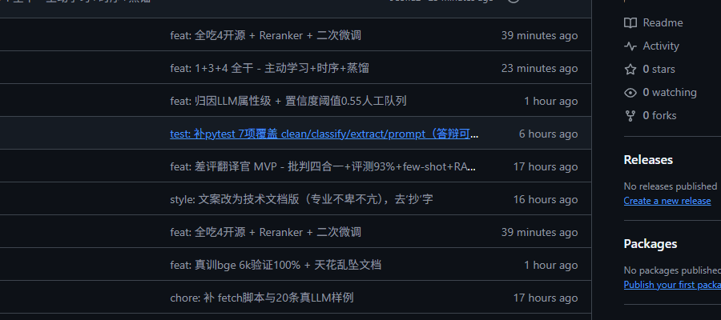
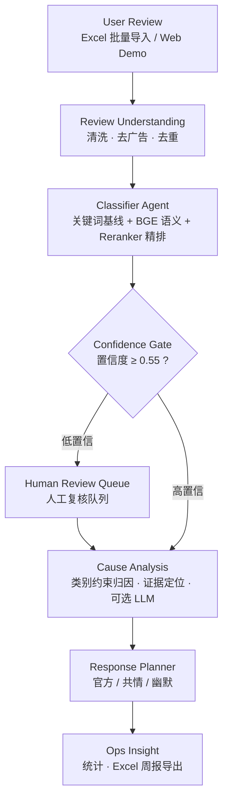

<p align="center">
  
</p>

# Bad Review Intelligence · 差评翻译官

**AI-powered E-commerce Complaint Analysis & Customer Support Assistant**
**面向中小商家的 AI 差评分析与客服辅助系统**

> 每天帮助中小商家从数百条客户评论中自动发现产品与服务问题，将人工筛选、归因和客服回复流程从小时级压缩到分钟级。

一句话定位：**一个结合 NLP 分类、LLM 推理与人工审核机制的电商客户反馈智能分析系统，将非结构化评论转化为可执行运营决策。**

在线 Demo：https://ilove-d5g0gzrpp375112b9-1413557923.tcloudbaseapp.com · 本地：`open frontend/index.html`

---

## Demo

<!-- TODO: 在此插入 Web Demo 与 Excel 周报截图（建议放 docs/screenshots/web-demo.png、docs/screenshots/weekly-report.png） -->

输入一条差评：

```text
用户评论: "等了5天才到，物流太慢了"
```

系统输出：

```text
类别:       物流慢
原因:       配送延迟（证据: "等了5天才到"）

官方回复:   您好，物流延迟给您添麻烦了，我们已催促并为您补发运费券，
            后续将加强时效监督，抱歉。

共情回复:   哎呀等5天确实让人着急，换我也得烦。我们已和物流催件，
            下次给您优先发货，这次真对不住了。

幽默回复:   哎哟这锅物流背定了！我这就拿小皮鞭催他们，再给您塞张运费券赔罪，
            下次保证让快递飞起来。
```

批量模式下，100 条评论产出一份可复核的 Excel 明细（类别 / 置信度 / 归因 / 证据 / 三种回复 / 是否需人工复核），并自动汇总运营周报。样例见 `data/mock_100_已分析.xlsx`、`data/周报_示例店铺_20260825-0831.xlsx`。

## 核心能力

- Excel 批量评论导入与清洗（去广告 / 去重 / 去噪）
- 四类高频投诉识别：物流慢 / 质量差 / 货不对版 / 客服态度差
- 关键词基线 + BGE 语义 + Reranker 精排的混合分类
- 低置信度样本自动进入人工复核队列，不强行自动化
- 类别约束下的问题原因提取与证据定位
- 官方 / 共情 / 幽默三种语气客服回复
- 统计结果与 Excel 周报导出
- FastAPI 接口 + Web Demo

> **设计原则：AI 不负责"显得聪明"，而负责减少可重复工作；无法可靠判断的样本应进入人工复核，而不是强行自动化。**

## Intelligent Workflow

系统按智能工作流组织，每一步都有明确产物，且自动决定哪些环节需要人介入：

| Step | 系统行为 | 产出 |
| ---- | -------- | ---- |
| 1. Review Understanding | 清洗、去广告、去重 | 可分析文本 |
| 2. Issue Classification | 关键词 + 语义 + Reranker 混合决策 | 投诉类别 + 置信度 |
| 3. Risk Gate | 置信度低于阈值自动升级，而非硬猜 | 待人工复核队列 |
| 4. Cause Analysis | 类别约束归因 + 证据定位 | 原因短语 + 原文证据 |
| 5. Response Planning | 三种语气回复策略 | 可直接使用的客服回复 |
| 6. Ops Insight | 跨评论聚合统计 | Excel 周报 / 运营洞察 |

## Architecture · Review Intelligence Agent



- **Classifier Agent**：核心决策层。关键词基线、BGE 语义、Reranker 二次精排混合决策，规则与模型互为补充。
- **Confidence Gate / Human Review**：低置信度（阈值 0.55）进入人工复核队列。系统长期以 `accuracy + automation coverage + human review rate` 衡量，而不是只看准确率。
- **Cause Analysis**：在预测类别约束下进行，基础为关键词证据定位，可选 LLM 提取更自然的属性级短语。
- **Response Planner**：语言表达层。无 API 时使用本地模板，可选 LLM 增强；核心链路离线可用。

## Model Analysis

评测按**业务价值优先**排序：真实业务验证 > 独立数据集 > 表征分析。三套数据目的不同，不混合比较。

### 1. Business Validation · 真实店铺试运行

与真实电商店铺（青竹小轩百货）合作完成小规模端到端试运行，验证完整业务闭环：

```text
Review Ingestion → Issue Classification → Root Cause Extraction → Reply Generation → Weekly Ops Report
```

产出包括分类结果、三种语气客服回复与可交付的运营周报（见 `data/周报_*.xlsx`、`试用证明_青竹小轩百货.docx`）。真实数据规模有限，该部分用于验证**业务流程可用性**，不作为模型准确率 benchmark。

### 2. Independent Benchmark · `mock_100`

100 条带人工标签的电商差评，用于横向比较分类方法。

| Method                         | Accuracy | Macro-F1 | Notes                  |
| ------------------------------ | -------: | -------: | ---------------------- |
| Keyword baseline               |  **93%** |     0.93 | 基于人工定义关键词              |
| BGE semantic labels            |      86% |     0.86 | BGE 与类别描述句相似度          |
| Hybrid                         |      88% |     0.88 | BGE + keyword fallback |
| Frozen BGE + linear classifier |      88% |        — | 公开数据训练后迁移至 mock_100    |

结论：**在类别少、关键词高度显式的窄域场景中，规则系统仍然是非常强的 baseline**。因此项目不假设"模型一定优于规则"，而采用可解释的混合策略。

### 3. Representation Learning Analysis · 公开数据集

从公开电商评论数据集抽取 6,000 条，按 80/20 分层划分（4,800 train / 1,200 val），采用 `BAAI/bge-small-zh-v1.5 → frozen embeddings → Logistic Regression`，编码器参数全程冻结，仅训练轻量线性分类器。

同分布 validation 上 Accuracy / Macro-F1 = 1.000。该结果用于验证 BGE 表征在当前四分类任务上的**线性可分性**，不将其视为对真实电商场景泛化能力的证明——泛化表现以 `mock_100` 与真实样本评测为准。

### 下一步评测

per-class Precision / Recall / F1、confusion matrix、multi-label 差评、low-confidence coverage、human review rate、latency / cost、hard-case error analysis。

## Tech Stack

| Layer      | Stack                                                                  |
| ---------- | ---------------------------------------------------------------------- |
| Backend    | Python · FastAPI · Uvicorn                                             |
| NLP        | BAAI/bge-small-zh-v1.5（Embedding）· BAAI/bge-reranker-base（精排）· Logistic Regression · 关键词规则 |
| LLM        | DeepSeek API（可选，仅用于归因短语与回复润色；无 API 时本地模板兜底）                  |
| Frontend   | 原生 HTML / CSS / JS 三栏式客服布局                                            |
| Data       | openpyxl（Excel 导入导出）                                                   |
| Deployment | 腾讯云（Web Demo + `bad-review-api`）· Dockerfile                           |

## Limitations

1. **分类体系覆盖有限**：当前仅覆盖物流慢 / 质量差 / 货不对版 / 客服态度差四类高频投诉，真实场景需要层级化 taxonomy。
2. **Single-label**：一条评论可能多问题共现（如"物流慢且客服不回"），当前取主类，multi-label 在路线图中。
3. **人工复核不可省**：低置信度与高风险差评必须人工确认后才能对外回复，系统定位是辅助而非替代。
4. **真实数据规模小**：目前试运行数据仅验证业务流程，不宣称商业级准确率，也不代表所有行业。
5. **规则边界**：反讽、隐喻、长文本、新品类下关键词规则会退化，需要语义模型补充。
6. **知识库**：当前为店铺知识上下文注入，尚未实现完整检索（chunk → embedding / BM25 → Top-K）链路。

## Project Direction

下一步重点：建立更大规模独立测试集、系统化 error analysis、升级 multi-label、引入置信度校准、量化 automation coverage / human review rate、将知识增强升级为真实检索链路、用更多真实店铺数据验证。

> 最终目标不是"所有差评交给 AI"，而是让高置信、重复性的工作自动完成，把模糊和高风险的留给人。

---

## 快速开始

```bash
pip install -r backend/requirements.txt
python backend/app.py                  # 100条 → data/mock_100_已分析.xlsx
DEEPSEEK_API_KEY=sk-... python backend/app.py  # 带LLM归因
```

API：`POST /analyze`（FastAPI，已上云 `bad-review-api`）

数据：`data/mock_100.xlsx` / `data/sample_6k.csv` / `data/周报_*.xlsx`

## 可复现性

所有路径已改为 `Path(__file__).resolve().parent` 相对路径，clone 后可直接运行。详见 `docs/benchmark.md`。

## License

MIT
